# Coupon Acceptance Analysis- Will the Customer Accept the Coupon?
This project explores consumer behavior in accepting driving-related coupons based on various demographic and contextual features. The analysis was conducted using a dataset with attributes such as age, gender, income, time of day, companion, and past visit behavior (e.g., bar, coffee shop, or restaurant frequency).

## Project Objectives
- Analyze which user groups are most likely to accept coupons.
- Compare acceptance rates across different demographic groups (age, gender, income, marital status).
- Identify patterns based on time of day, companions, and location.
- Visualize the results using count plots and bar charts.
- Formulate hypotheses to understand influential factors.

## Technologies Used
- Python
- Pandas
- Seaborn / Matplotlib
- Google Colab
- Numpy
- plotly

## Notebooks
- coupon_analysis.ipynb: [link to colab notebook code](https://drive.google.com/file/d/1FaYJIwel29aY514VXwAM2iGC_nz1itWV/view?usp=sharing)

## Data Cleaning 
Data Cleaning Steps

Age Grouping:
- Created simplified age groups: under21, 21 to 50, and over50 based on string labels.
- Queried coffee_coupons dataset to compute acceptance rates for each group.

Filtering:
- Subsets were created using .query() for:
  -   Drivers who go to bars more than once a month and are not widowed or traveling with kids.
  -   Drivers under age 30 who go to bars.
  -   Low-income drivers (< $50K) who frequently visit cheap restaurants.

Handling Missing or Incorrect Values:
- Dropped the car column due to excessive missing values (~99%)

- Extracted numeric values and converted them to float format.
bar_coupons['income_clean'] = bar_coupons['income'].str.replace('[\$,]', '', regex=True).str.extract('(\d+)', expand=False).astype(float)

## Results, Findings and Analysis
**H1: Carryout/Takeaway coupons have the highest acceptance rate among all coupon types.**
*Supporting Evidence:* 73.4% acceptance vs. 56% overall acceptance.
Interpretation: Carryout options offer convenience and low commitment, making them broadly appealing. This suggests strong consumer preference for quick, easy meal solutions.

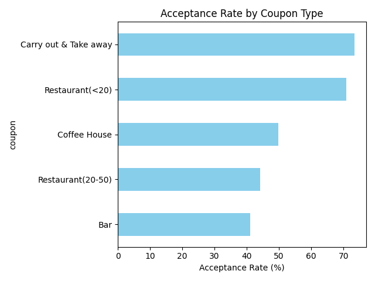

**H2: Bar coupons are the least likely to be accepted unless the driver is a frequent bar-goer.**
*Supporting Evidence:* 37% general acceptance vs. 76.9% for frequent bar-goers.
Interpretation: Bar coupon value is highly dependent on personal habits—those who rarely go to bars are unlikely to be influenced, while regulars see clear benefit.

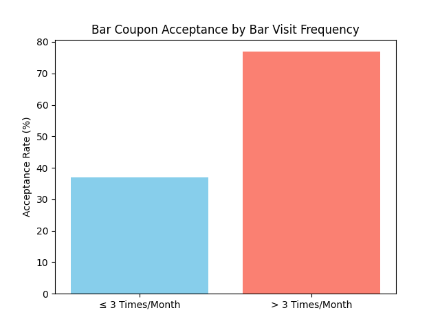

**H3: Drivers aged 25+ who frequently visit bars are significantly more likely to accept bar coupons.**
*Supporting Evidence:* 70% acceptance for 25+ frequent goers vs. 34.8% for others.
Interpretation: Older frequent bar-goers may have more purchasing power and social motivations, making them prime targets for bar-related offers.

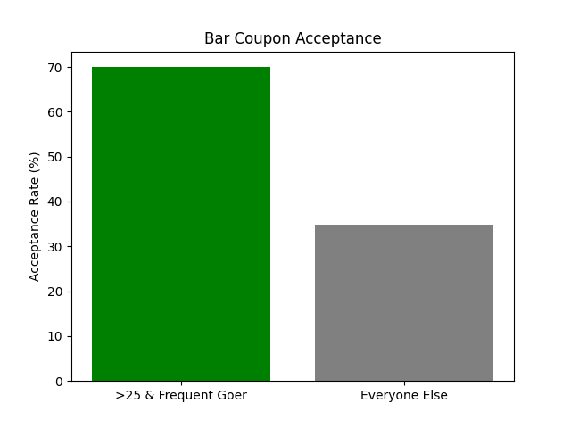

**H4: Bar coupon acceptance is highest among drivers who go to bars 1–3 times per month.**
*Supporting Evidence:* Highest acceptance count in this frequency group.
Interpretation: Moderate bar-goers may see coupons as added incentive, whereas infrequent goers ignore them and heavy goers may already be committed regardless of offers.

**H5: 21-year-old drivers show the highest acceptance count for bar coupons.**
*Supporting Evidence:* Age 21 tops in acceptance count.
Interpretation: This age marks legal drinking age in many regions—drivers may be newly exposed to bar culture and more enthusiastic about related deals.

<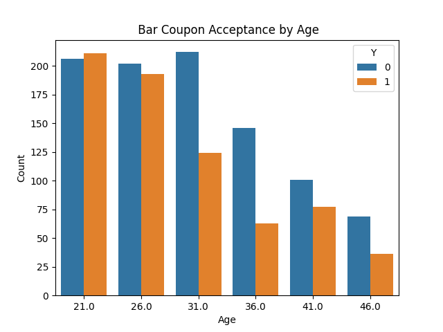

**H6: Drivers under 30 and with incomes < $50K are more likely to accept coupons in general.**
*Supporting Evidence:* Observed trend in acceptance by age and income brackets.
Interpretation: Younger, lower-income individuals may be more cost-conscious and more motivated by savings offered through coupons.

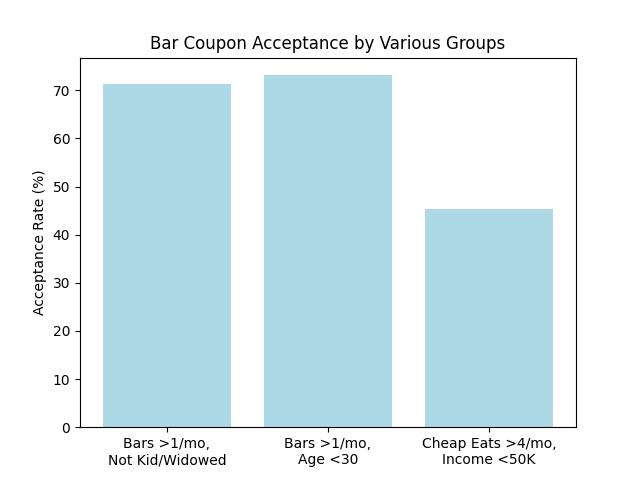

**H7: Drivers with adult passengers are more likely to accept bar coupons than those with children.**
*Supporting Evidence:* Acceptance rates higher for adult passengers.
Interpretation: Bar outings are typically social/adult-oriented, making them less appealing or practical for drivers accompanied by children.

 

**H8: Higher temperatures increase overall coupon acceptance rates.**
*Supporting Evidence:* Correlation observed around 80°F.
Interpretation: Warm weather may encourage outings, increase thirst/hunger, or boost general social activity—raising receptiveness to food and drink coupons.

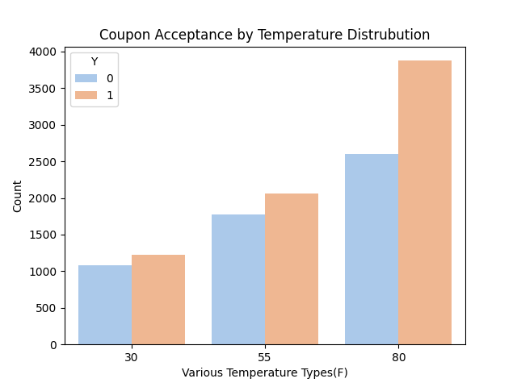

## Results and Findings for Independent Study 

**H1: Coffee coupons are more likely to be accepted in the morning or afternoon than in the evening.**
*Supporting Evidence:* Acceptance rates were higher in the afternoon (54.8%) and morning (54.2%), compared to the evening (41.5%).
Interpretation: This suggests coffee consumption is aligned with daytime energy needs (work, study), while the evening sees lower interest in caffeine.

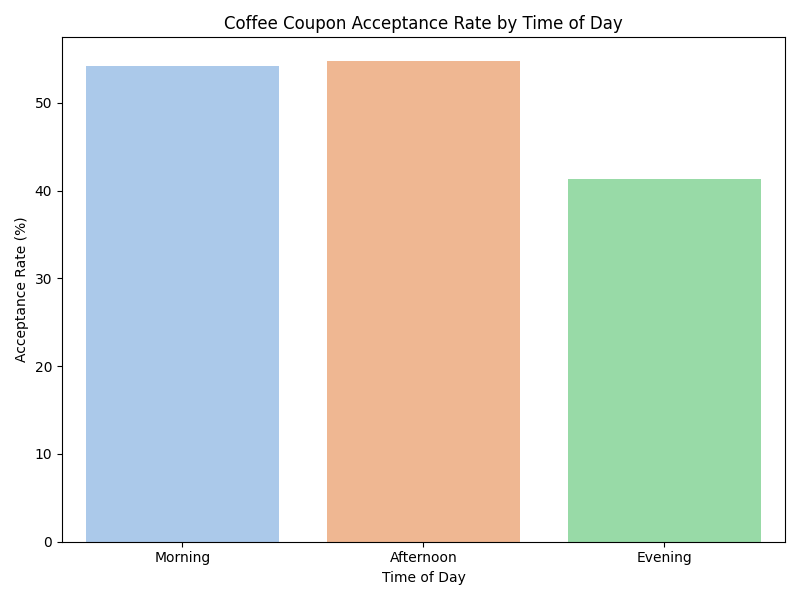

**H2: Drivers traveling with a friend or partner are more likely to accept the coffee coupon than those traveling alone.**
*Supporting Evidence:* Acceptance rates: friend (59.6%), partner (56.9%), alone (43.76%).
Interpretation: Social company may encourage spontaneous decisions like stopping for coffee.

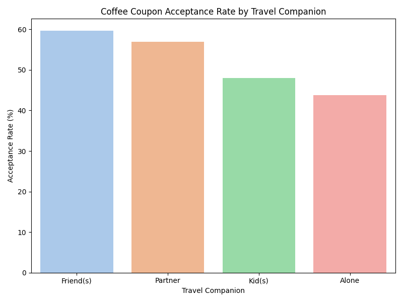

**H3: Gender does not significantly impact coffee coupon acceptance.**
*Supporting Evidence:* Nearly equal acceptance rates among females (49%) and males (51%).
Interpretation: Suggests that gender does not meaningfully influence coffee consumption decisions in this context.

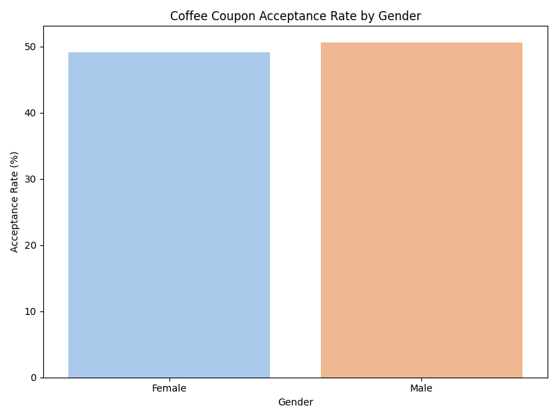

**H4: Younger passengers are more likely to accept the coffee coupon than older age groups.**
Motivation: Younger individuals may be more receptive to spontaneous offers, more engaged with social outings, or more frequent coffee consumers.

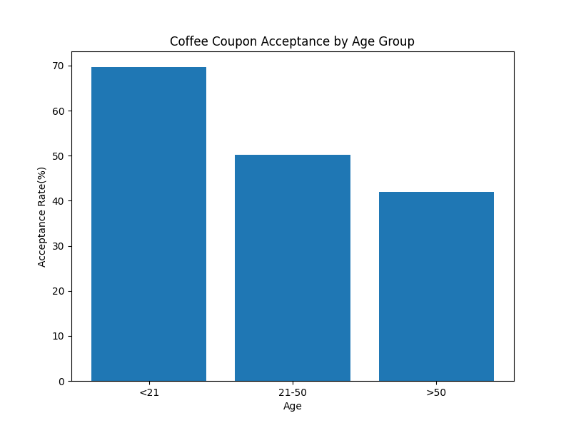

**H5: The overall coffee coupon acceptance rate is balanced across the dataset.**
*Supporting Evidence:* 49.86% accepted vs. 50.14% did not.
Interpretation: There is no overwhelming trend in favor or against coffee coupon acceptance at the population level—differences appear in subgroup behavior.

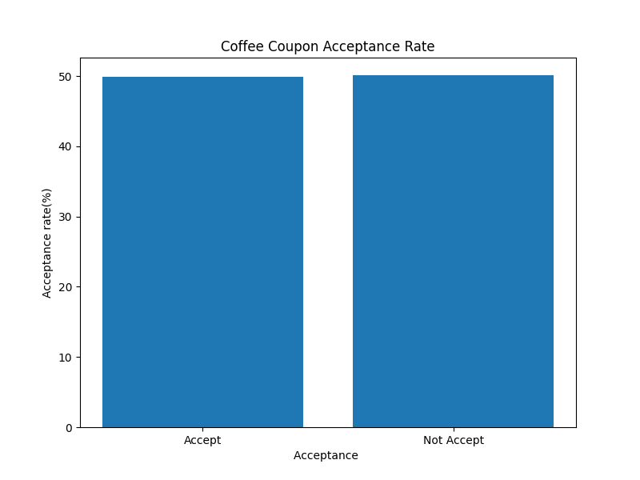

## Next Steps
- Train classification models (e.g., logistic regression, decision tree) to predict coupon acceptance.
- Increasing the data and having a larger sample size. The sample size for each coupon was different, making the data/results not as reliable as it would be if the sample size was around the same for each coupon size. 

#
